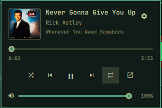

# omarchy-plugin-media

A media bar-widget for the [Omarchy](https://omarchy.org/) shell, cloned
from the built-in `omarchy.media`. It shows what's playing over MPRIS and
opens a popup with playback controls and a live progress bar you can seek
with. What the widget shows in the bar is configurable.

## What it does

- Bar widget with the play/pause state and the track text
- Popup with album art, track info and previous / play-pause / next
- **Live progress bar** with elapsed and total time, updated in real time
- **Seek** by clicking, dragging or scrolling the bar (when the player allows it)
- Shuffle, repeat, playback speed, volume and "open player" controls
- Source list to switch between players (Tab in the popup)
- **Advanced options** to choose what the bar shows and how it looks
- `media` IPC target for scripts and hotkeys

## Preview



## Usage

| Action           | Effect               |
| ---------------- | -------------------- |
| Left click       | Toggle the popup     |
| Right click      | Play / pause         |
| Middle click     | Next track           |
| Scroll up        | Previous track       |
| Scroll down      | Next track           |

The play/pause icon in the bar is itself a button: a left click on it plays
or pauses (a left click anywhere else on the widget still opens the popup).
On a vertical bar the icon is the whole widget, so there it just opens the
popup.

With the `showPrevious` / `showNext` options on, the bar also gets small
previous / next buttons next to the icon; clicking them skips tracks. They
dim when the player can't go that way and are hidden on a vertical bar.

This is the inverse of `omarchy.media`, where left click plays/pauses and
right click opens the popup.

### Progress bar

- Shown only when the player reports both position and length. Live
  streams and players without them get no bar.
- If the player doesn't support seeking, the bar is display-only.
- Click anywhere on the bar to jump there, or drag; the seek is applied
  when you release the mouse. Scrolling over it seeks by 5 s.

### Popup

Buttons: shuffle, previous, play/pause, next, repeat, open player and
playback speed (each only when the player supports it), plus a volume
slider. The gear in the corner opens the advanced options.

Keyboard, while the popup is open:

| Key                    | Effect                                  |
| ---------------------- | --------------------------------------- |
| Tab / Shift+Tab        | Switch between available players        |
| Space / Enter          | Play / pause                            |
| Left / Right (`h`/`l`) | Seek -5 s / +5 s                        |
| Up / Down (`k`/`j`)    | Volume +5% / -5%                        |
| `n` / `p`              | Next / previous track                   |
| `s` / `r` / `f`        | Shuffle / repeat / playback speed       |
| `o`                    | Open the player window                  |
| `c`                    | Open / close the advanced options       |
| `q` / Esc              | Close the popup (or leave the options)  |

## Install

```bash
omarchy plugin add https://github.com/vinicgobbi/omarchy-plugin-media.git --enable
```

Disable any other media widget (`omarchy.media`, `bibek.media`) so only
one media service is active.

## Update

```bash
omarchy plugin update vinicgobbi.media
```

## Uninstall

```bash
omarchy plugin remove vinicgobbi.media
```

## Options

Open the gear in the popup for a live preview and three tabs, or edit the
widget's entry in `~/.config/omarchy/shell.json` by hand. Only the options
that differ from the defaults are written there:

```json
{ "id": "vinicgobbi.media", "showCover": true, "separator": "|", "dynamicWidth": true }
```

| Option           | Default  | What it does                                                        |
| ---------------- | -------- | ------------------------------------------------------------------- |
| `showIcon`       | `true`   | Play/pause symbol before the text                                   |
| `showPrevious`   | `false`  | Clickable "previous track" button next to the icon                  |
| `showNext`       | `false`  | Clickable "next track" button next to the icon                      |
| `showCover`      | `false`  | Small album cover before the text                                   |
| `showTitle`      | `true`   | Track title                                                         |
| `showArtist`     | `true`   | Track artist                                                        |
| `showAlbum`      | `false`  | Album name                                                          |
| `showPlayer`     | `false`  | Name of the app playing (Spotify, Chrome...)                        |
| `showTime`       | `false`  | Elapsed / total time next to the text                               |
| `artistFirst`    | `false`  | "artist · title" instead of "title · artist"                        |
| `separator`      | `"·"`    | Between the pieces of text: `·`, `-`, `\|` or `/`                   |
| `hideWhenPaused` | `false`  | Hide the widget while nothing is playing                            |
| `dynamicWidth`   | `false`  | `true`: show the whole text and fit the widget to it                |
| `textMode`       | `scroll` | Fixed width only: `scroll` the text or cut it (`ellipsis`) with "..." |
| `maxWidth`       | `180`    | Fixed width only: widget width in px                                |
| `maxChars`       | `40`     | Fixed width and `ellipsis` only: where the text is cut              |

The same options are declared in the manifest's `schema`, so they also show
up wherever Omarchy renders plugin settings.

## Notes

Based on the built-in `omarchy.media` plugin by the Omarchy team.

## Contributing

See [CONTRIBUTING.md](CONTRIBUTING.md) for local setup, the plugin's
file structure, and the commit/release process.

## License

[MIT](LICENSE)
